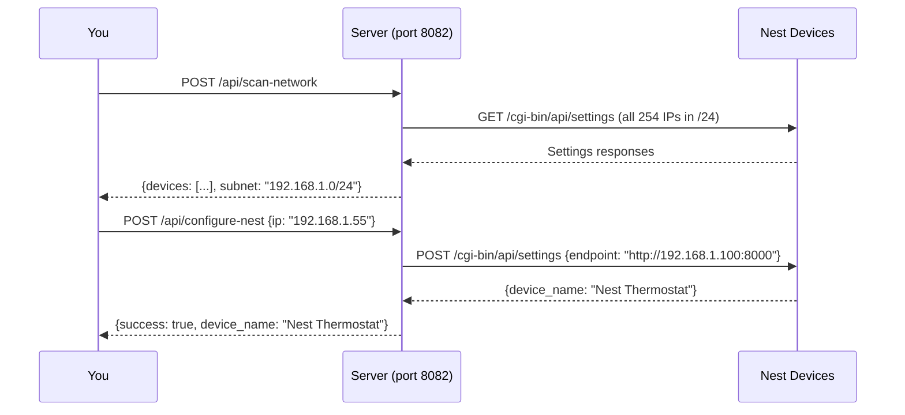

## Overview

Scans the `/24` subnet derived from the server's `api_origin` setting and returns all Nest devices found on port 8080. For each device found, it reports whether the device is already configured to point at this server.

## Endpoint

```
POST http://your-server:8082/api/scan-network
```

No request body needed.

## Response

### Success (200 OK)

```json
{
  "devices": [
    {
      "ip": "192.168.1.42",
      "device_name": "Nest Thermostat",
      "cloudregisterurl": "http://192.168.1.100:8000",
      "configured": true
    },
    {
      "ip": "192.168.1.55",
      "device_name": "Nest Thermostat",
      "cloudregisterurl": "https://home.nest.com",
      "configured": false
    }
  ],
  "subnet": "192.168.1.0/24"
}
```

### Response Fields

| Field | Type | Description |
|-------|------|-------------|
| `devices` | array | Found Nest devices |
| `subnet` | string | The subnet that was scanned |
| `devices[].ip` | string | Device IP address |
| `devices[].device_name` | string | Device name as configured on the thermostat |
| `devices[].cloudregisterurl` | string | Current server URL the device is pointed at |
| `devices[].configured` | boolean | `true` if device is already pointed at this server |

### Error (400 Bad Request)

```json
{"error": "Cannot derive subnet: api_origin has no hostname"}
```

```json
{"error": "Cannot resolve 'my-server' to an IP address. Set api_origin to use an IP address instead of a hostname."}
```

## How It Works

The scan:
1. Derives the subnet from your server's `API_ORIGIN` setting (e.g., `http://192.168.1.100:8000` → scan `192.168.1.0/24`)
2. Concurrently probes all 254 hosts for a Nest local API on port 8080 (`GET /cgi-bin/api/settings`)
3. Returns devices that responded, comparing their `cloudregisterurl` to your server's origin

<Warning>
  The scan requires `API_ORIGIN` to be set to an IP address (not a hostname), or the hostname must be DNS-resolvable from the server. If `API_ORIGIN` uses a domain name that can't be resolved, the scan will fail with an error.
</Warning>

## Typical Workflow



## Example

```bash
curl -X POST http://your-server:8082/api/scan-network
```

## Related

<CardGroup cols={2}>
  <Card title="POST /api/configure-nest" href="/api-reference/control/configure-nest">
    Point a discovered device at this server
  </Card>
  <Card title="POST /api/register" href="/api-reference/control/register">
    Register a device after configuring it
  </Card>
</CardGroup>
