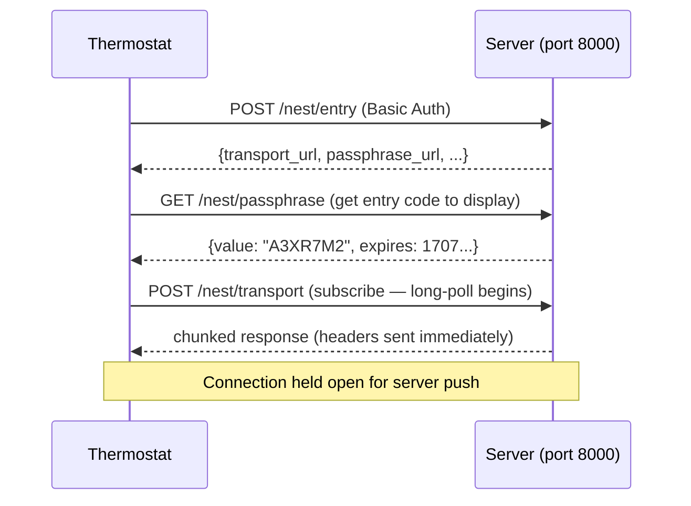

## Overview

`/nest/entry` is the **first request** a Nest thermostat makes when it boots or reconnects to WiFi. The device uses the response to discover the URLs for all other services it needs.

<Info>
  This endpoint is part of the **Device Protocol API** on port 8000. It is called directly by thermostat firmware — you do not need to call it yourself.
</Info>

## Endpoint

```
GET  http://your-server:8000/nest/entry
POST http://your-server:8000/nest/entry
```

Both methods are supported. Production firmware uses POST with form-urlencoded body.

## Authentication

HTTP Basic Auth. The device sends its serial number embedded in the user ID:

```
Authorization: Basic <base64(d.SERIAL.SUFFIX:password)>
```

The server extracts the serial from the Basic Auth user ID and accepts all credentials.

## Request

### POST (form-urlencoded — production firmware)

```http
POST /nest/entry HTTP/1.1
Host: your-server:8000
Content-Type: application/x-www-form-urlencoded
Authorization: Basic <base64(d.09AA01AB12345678.BC7C9039:password)>

reset=FALSE&mac=18B430ABCDEF&model=Diamond-2.6&request_id=1&software_version=5.9.3-5
```

### POST body fields

| Field | Description |
|-------|-------------|
| `reset` | `TRUE` if factory reset, `FALSE` otherwise |
| `mac` | WiFi MAC address (12 hex chars, no separators) |
| `model` | Device model string (e.g., `Diamond-2.6`) |
| `request_id` | Monotonically increasing request counter |
| `software_version` | Current firmware version |
| `wireless_reg_domain` | WiFi regulatory domain (e.g., `US`, `EU`) |
| `backplate_model` | Backplate model string |

## Response

### Self-Hosted Response (200 OK)

The self-hosted server returns a **flat JSON object** — no wrapper object:

```json
{
  "czfe_url": "http://your-server:8000/nest/transport",
  "transport_url": "http://your-server:8000/nest/transport",
  "direct_transport_url": "http://your-server:8000/nest/transport",
  "passphrase_url": "http://your-server:8000/nest/passphrase",
  "ping_url": "http://your-server:8000/nest/transport",
  "pro_info_url": "http://your-server:8000/nest/pro_info",
  "weather_url": "http://your-server:8000/nest/weather/v1?query=",
  "upload_url": "http://your-server:8000/nest/upload",
  "software_update_url": "",
  "server_version": "1.0.1",
  "tier_name": "local"
}
```

### Self-Hosted Response Fields

| Field | Type | Description |
|-------|------|-------------|
| `czfe_url` | string | Primary transport URL (same as `transport_url`) |
| `transport_url` | string | Long-poll subscribe/PUT endpoint |
| `direct_transport_url` | string | Direct transport URL (same server) |
| `passphrase_url` | string | Entry key generation endpoint for device pairing |
| `ping_url` | string | Connectivity health check endpoint |
| `pro_info_url` | string | Pro device info endpoint |
| `weather_url` | string | Weather proxy endpoint |
| `upload_url` | string | Device log upload endpoint |
| `software_update_url` | string | Firmware update URL (empty — no OTA updates) |
| `server_version` | string | Server software version |
| `tier_name` | string | Always `"local"` for self-hosted |

<Warning>
  All URLs sent to the device **must include an explicit port number** (e.g., `:8000`). URLs without an explicit port can cause the device to fail TCP keepalive offload (WoWLAN), which is required for low-power operation. The server automatically appends the port via `api_origin_with_port`.
</Warning>

### Hosted Service Response

The hosted service returns additional fields:

```json
{
  "transport_url": "https://backdoor.nolongerevil.com",
  "weather_url": "https://backdoor.nolongerevil.com",
  "czfe_url": "https://backdoor.nolongerevil.com",
  "direct_transport_url": "https://backdoor.nolongerevil.com",
  "passphrase_url": "https://backdoor.nolongerevil.com/nest/passphrase",
  "upload_url": "https://backdoor.nolongerevil.com/nest/upload",
  "software_update_url": "",
  "server_version": "1.0.1",
  "tier_name": "hosted"
}
```

## Device Flow After Entry

After receiving the entry response, the thermostat:

1. Stores the `transport_url`
2. Calls `GET {passphrase_url}` to get an entry key (for display during pairing)
3. Begins long-poll subscribing at `POST {transport_url}` (the subscribe endpoint)


```mermaid
sequenceDiagram
    participant T as Thermostat
    participant S as Server (port 8000)

    T->>S: POST /nest/entry (Basic Auth)
    S-->>T: {transport_url, passphrase_url, ...}
    T->>S: GET /nest/passphrase (get entry code to display)
    S-->>T: {value: "A3XR7M2", expires: 1707...}
    T->>S: POST /nest/transport (subscribe — long-poll begins)
    S-->>T: chunked response (headers sent immediately)
    Note over T,S: Connection held open for server push
```

## Example

```bash
curl -X POST http://your-server:8000/nest/entry \
  -u "d.02AB01AC012345678.00000000:password" \
  -H "Content-Type: application/x-www-form-urlencoded" \
  --data-urlencode "reset=FALSE" \
  --data-urlencode "model=Diamond-2.6" \
  --data-urlencode "software_version=5.9.3-5"
```

## Next Steps

<CardGroup cols={2}>
  <Card title="GET /nest/passphrase" href="/api-reference/thermostat/passphrase">
    Entry key generation for device pairing
  </Card>
  <Card title="POST /nest/transport" href="/api-reference/thermostat/transport-subscribe">
    Long-poll subscribe endpoint
  </Card>
</CardGroup>
