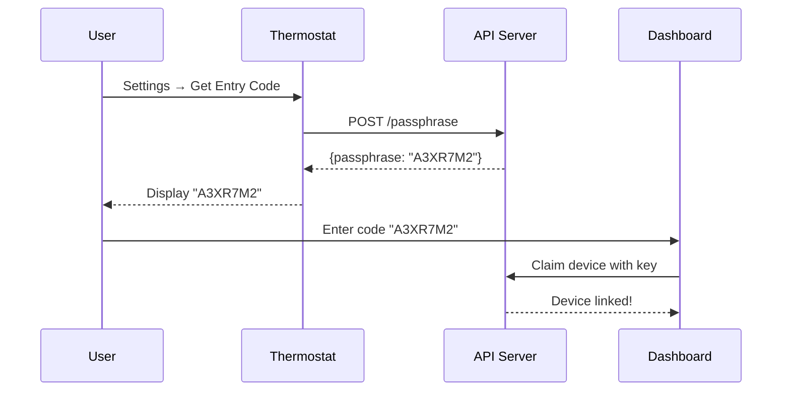

## Overview

The `/passphrase` endpoint generates 7-character entry keys that allow users to claim (link) devices to their accounts.

## Endpoint

```
POST/GET https://backdoor.nolongerevil.com/passphrase
```

## Authentication

HTTP Basic Auth with device serial number

## Request

```http
POST /passphrase HTTP/1.1
Host: backdoor.nolongerevil.com
Authorization: Basic {base64(serial:serial)}
```

## Response (200 OK)

```json
{
  "passphrase": "A3XR7M2",
  "expires_at": "2025-11-11T14:30:00Z"
}
```

### Response Fields

| Field | Type | Description |
|-------|------|-------------|
| `passphrase` | String | 7-character entry key (uppercase letters/numbers) |
| `expires_at` | String (ISO 8601) | Expiration timestamp (default: 1 hour from now) |

## Example

```bash
curl -X POST https://backdoor.nolongerevil.com/passphrase \
  -u "02AB01AC012345678:02AB01AC012345678"
```

Response:
```json
{
  "passphrase": "K9M2XPR",
  "expires_at": "2025-11-11T15:00:00Z"
}
```

## Entry Key Properties

- **Length**: 7 characters
- **Character set**: Uppercase A-Z and 0-9 (excluding ambiguous: 0/O, 1/I/L)
- **Lifespan**: 1 hour (configurable via `ENTRY_KEY_TTL_SECONDS`)
- **Single-use**: Can only claim one device
- **Random generation**: Secure random generation prevents guessing

## Use Cases

### 1. Device Claiming Flow



### 2. Thermostat Display

The thermostat shows the entry key on screen:

```
┌─────────────────────┐
│   Entry Code        │
│                     │
│     A 3 X R 7 M 2   │
│                     │
│  Valid for 60 min   │
└─────────────────────┘
```

## Server Implementation

```javascript
app.post('/passphrase', async (req, res) => {
  const serial = extractSerialFromAuth(req);
  
  // Generate random 7-char code
  const passphrase = generateSecureKey(7);
  const expiresAt = Date.now() + (process.env.ENTRY_KEY_TTL_SECONDS || 3600) * 1000;
  
  // Store in database
  await convex.mutation('users:generateEntryKey', {
    key: passphrase,
    serial,
    expiresAt
  });
  
  res.json({ passphrase, expires_at: new Date(expiresAt).toISOString() });
});
```

## Security Considerations

<Warning>
  **Entry keys are temporary secrets.** Don't share them publicly or via insecure channels.
</Warning>

- Expires after 1 hour automatically
- Single-use (marked as used after claiming)
- Requires physical access to thermostat to view
- Can be regenerated unlimited times

## Next Steps

<Card title="Claiming Devices" href="/hosted/claiming-device">
  Learn how users claim devices with entry keys
</Card>
