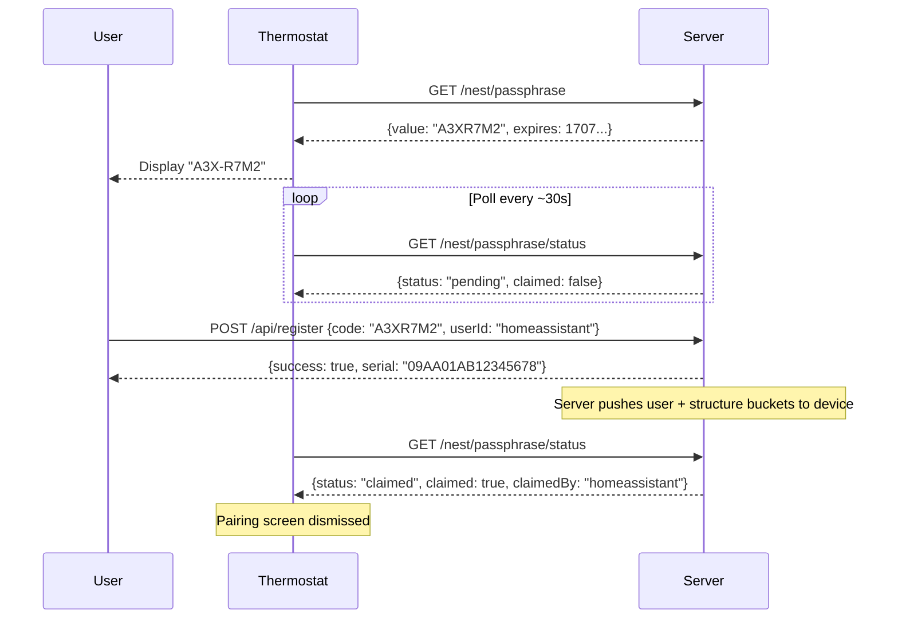

## Overview

The `/nest/passphrase` endpoint generates 7-character entry keys that allow users to claim (link) devices to their accounts. The device polls this endpoint during pairing to get the code it displays on-screen.

A companion endpoint `/nest/passphrase/status` lets the device poll to find out if its entry key has been claimed.

<Info>
  These endpoints are part of the **Device Protocol API** on port 8000. They are called directly by thermostat firmware during the pairing flow.
</Info>

## Endpoints

```
GET http://your-server:8000/nest/passphrase
GET http://your-server:8000/nest/passphrase/status
```

---

## GET /nest/passphrase

Returns the current unexpired entry key for the device. If no valid key exists, a new one is generated.

The device polls this endpoint repeatedly during pairing. The server returns the **same** key on each request until it's claimed or expires — generating a new key on each call would invalidate the key before the user can enter it.

### Request

```http
GET /nest/passphrase HTTP/1.1
Host: your-server:8000
Authorization: Basic <base64(d.SERIAL.SUFFIX:password)>
```

The device serial is extracted from the Basic Auth user ID.

### Response (200 OK)

```json
{
  "value": "A3XR7M2",
  "expires": 1707234600000
}
```

| Field | Type | Description |
|-------|------|-------------|
| `value` | string | 7-character alphanumeric entry key (e.g., `A3XR7M2`) |
| `expires` | **number** | Expiration timestamp in **milliseconds** since Unix epoch |

<Warning>
  The `expires` field **must be a JSON number**, not a string. If it is sent as `"1707234600000"` (a string), the device silently rejects the response and never displays the entry key. The expiration must be at least 30 minutes in the future.
</Warning>

### Entry Key Properties

- **Length**: 7 alphanumeric characters
- **Display format**: The device shows the code as `XXX-XXXX` (e.g., `A3X-R7M2`)
- **TTL**: 1 hour by default (configurable via `ENTRY_KEY_TTL_SECONDS`)
- **Reuse**: The same key is returned until claimed or expired
- **Single-use**: Can only be claimed once

### Error Responses

| Status | Body | Cause |
|--------|------|-------|
| `400` | `{"error": "Device serial required"}` | Missing or unparseable Basic Auth |
| `503` | `{"error": "Entry key service unavailable"}` | Database unavailable |

---

## GET /nest/passphrase/status

Lets the device poll to discover if its entry key has been claimed by a user.

### Request

```http
GET /nest/passphrase/status HTTP/1.1
Host: your-server:8000
Authorization: Basic <base64(d.SERIAL.SUFFIX:password)>
```

### Response: No Key Found

```json
{
  "status": "no_key",
  "claimed": false,
  "message": "No entry key found for this device"
}
```

### Response: Key Pending (not yet claimed)

```json
{
  "status": "pending",
  "claimed": false,
  "expiresAt": 1707234600000
}
```

### Response: Key Claimed

```json
{
  "status": "claimed",
  "claimed": true,
  "claimedBy": "homeassistant",
  "claimedAt": 1707231000000
}
```

| Field | Type | Description |
|-------|------|-------------|
| `status` | string | `"no_key"`, `"pending"`, or `"claimed"` |
| `claimed` | boolean | Whether the key has been claimed |
| `claimedBy` | string | User ID that claimed the key (when `claimed: true`) |
| `claimedAt` | number | Claim timestamp in ms (when `claimed: true`) |
| `expiresAt` | number | Expiration timestamp in ms (when `status: "pending"`) |

---

## Pairing Flow


```mermaid
sequenceDiagram
    participant U as User
    participant T as Thermostat
    participant S as Server

    T->>S: GET /nest/passphrase
    S-->>T: {value: "A3XR7M2", expires: 1707...}
    T-->>U: Display "A3X-R7M2"

    loop Poll every ~30s
        T->>S: GET /nest/passphrase/status
        S-->>T: {status: "pending", claimed: false}
    end

    U->>S: POST /api/register {code: "A3XR7M2", userId: "homeassistant"}
    S-->>U: {success: true, serial: "09AA01AB12345678"}
    Note over S: Server pushes user + structure buckets to device

    T->>S: GET /nest/passphrase/status
    S-->>T: {status: "claimed", claimed: true, claimedBy: "homeassistant"}
    Note over T: Pairing screen dismissed
```

## Next Steps

<CardGroup cols={2}>
  <Card title="POST /api/register" href="/api-reference/control/register">
    Claim an entry key and register a device
  </Card>
  <Card title="POST /nest/transport" href="/api-reference/thermostat/transport-subscribe">
    Subscribe endpoint (long-poll)
  </Card>
</CardGroup>
