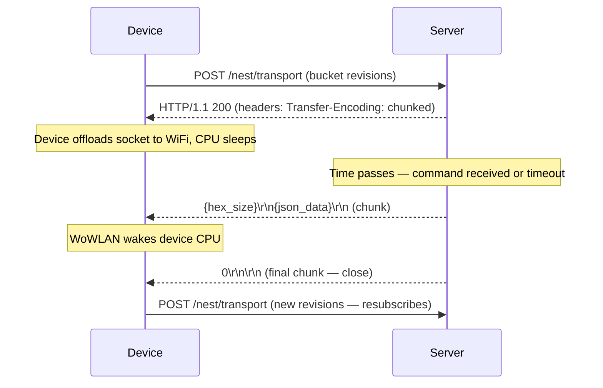

## Overview

`POST /nest/transport` is the heart of the Nest Cloud Protocol. The thermostat maintains a persistent HTTP connection here and receives server-pushed state updates via chunked transfer encoding.

<Info>
  This endpoint is part of the **Device Protocol API** on port 8000. It is called exclusively by thermostat firmware — you do not call it directly.
</Info>

## Endpoint

```
POST http://your-server:8000/nest/transport
```

## How It Works

The subscribe endpoint implements a long-poll pattern:

1. **Device connects** — sends its current bucket revisions/timestamps
2. **Server responds with headers immediately** — `Transfer-Encoding: chunked` is sent right away, allowing the device to offload the open connection to WiFi hardware and sleep
3. **Server holds the connection** — either sends a JSON chunk immediately (if server has newer data) or waits silently
4. **Server sends a chunk** — when state changes, the server serializes the updated buckets and sends them as a chunked response body, waking the device via WoWLAN
5. **Server closes after a batch window** — waits up to 3 seconds after the first chunk for additional data, then closes the connection
6. **Device resubscribes** — on connection close (or after `suspend_time_max` seconds as a safety net), the device reconnects



## Request

### Headers

```http
POST /nest/transport HTTP/1.1
Host: your-server:8000
Content-Type: application/json
Authorization: Basic <base64(d.SERIAL.SUFFIX:password)>
X-nl-protocol-version: 1
```

### Body

The device sends an `objects` array with its current bucket revisions:

```json
{
  "chunked": true,
  "session": "18b430SERIAL",
  "objects": [
    {
      "object_key": "device.09AA01AB12345678",
      "object_revision": 42,
      "object_timestamp": 1707148800000
    },
    {
      "object_key": "shared.09AA01AB12345678",
      "object_revision": 15,
      "object_timestamp": 1707148800000
    },
    {
      "object_key": "schedule.09AA01AB12345678",
      "object_revision": 3,
      "object_timestamp": 1707148800000
    }
  ]
}
```

The device may also send **inline updates** by including a `value` field with `object_revision: 0` and `object_timestamp: 0`:

```json
{
  "chunked": true,
  "session": "18b430SERIAL",
  "objects": [
    {
      "object_key": "shared.09AA01AB12345678",
      "object_revision": 0,
      "object_timestamp": 0,
      "value": {
        "target_temperature": 22.0,
        "target_temperature_type": "heat"
      }
    }
  ]
}
```

### Request Body Fields

| Field | Type | Description |
|-------|------|-------------|
| `chunked` | boolean | Always `true` — device expects chunked response |
| `session` | string | Persistent session identifier (reused across reconnects) |
| `objects` | array | Bucket descriptors with device's current state |
| `objects[].object_key` | string | Bucket key, e.g., `device.09AA01AB12345678` |
| `objects[].object_revision` | integer | Device's current revision for this bucket |
| `objects[].object_timestamp` | integer | Device's current timestamp for this bucket (ms) |
| `objects[].value` | object | (Inline update only) New field values; only used when rev=0 and ts=0 |

## Response Headers

```http
HTTP/1.1 200 OK
Transfer-Encoding: chunked
X-nl-suspend-time-max: 300
X-nl-service-timestamp: 1707148800000
X-nl-defer-device-window: 15
```

| Header | Description |
|--------|-------------|
| `Transfer-Encoding: chunked` | Required — enables server push and WoWLAN sleep |
| `X-nl-suspend-time-max` | Device's safety-net wake timer in seconds (default: 300) |
| `X-nl-service-timestamp` | Server timestamp in ms — device uses for sync decisions |
| `X-nl-defer-device-window` | Seconds to delay device PUT after local changes (batches dial jitter) |
| `X-nl-disable-defer-window` | Seconds to temporarily disable defer delay after a server push |

## Response Body (Chunked)

When the server has data to push, it sends a JSON object in a chunked body:

```
{hex_size}\r\n
{"objects": [...]}\r\n
0\r\n
\r\n
```

The JSON payload uses an `objects` array:

```json
{
  "objects": [
    {
      "object_revision": 16,
      "object_timestamp": 1707149000000,
      "object_key": "shared.09AA01AB12345678",
      "value": {
        "target_temperature": 22.0,
        "target_temperature_type": "heat"
      }
    }
  ]
}
```

<Warning>
  **Field ordering is critical.** `object_revision` and `object_timestamp` **must appear before** `object_key` in each object. Incorrect field ordering can cause the device to silently ignore the update or fail to parse it.

  **Correct:** `{"object_revision": 16, "object_timestamp": ..., "object_key": "...", "value": {...}}`

  **Wrong:** `{"object_key": "...", "object_revision": 16, ...}`
</Warning>

### When No Data Is Available

If the server has no updates to send immediately, it **holds the connection open silently** (no body, no empty JSON). It does NOT send an empty `{}` or an empty `objects` array. The connection is held until:
- Data arrives to push (then a chunk is sent)
- `connection_hold_timeout` seconds elapse (default: `suspend_time_max - 10 = 290s`), at which point the connection closes with no body

## Synchronization Logic

The server compares timestamps (not revisions) to decide what to push:

- If `server_timestamp > device_timestamp` for a bucket → include it in the response
- If `device_timestamp > server_timestamp` → merge the inline value into server state (if it's an inline update)
- **Timestamp = 0** is a sentinel meaning "no data for this bucket yet"

## Security Considerations

The server accepts all credentials. The device serial is extracted from the Basic Auth user ID (`d.{SERIAL}.{suffix}`) and used for state lookup.

## Related

<CardGroup cols={2}>
  <Card title="POST /nest/transport/put" href="/api-reference/thermostat/transport-put">
    Device-to-server state updates
  </Card>
  <Card title="Nest Protocol: Transport" href="/nest-protocol/transport">
    Deep dive on the subscribe/push mechanism
  </Card>
</CardGroup>
