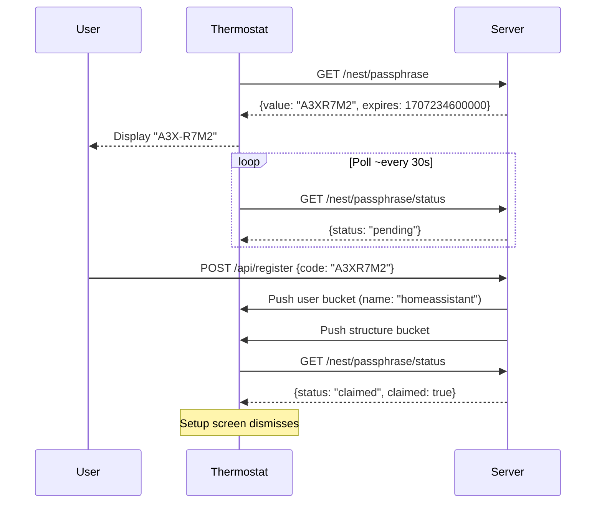

## Overview

The `user` bucket exists for one purpose: triggering pairing completion on the device. When the device receives a user bucket with a `name` field, it records the value as its pairing token and dismisses the setup screen.

**Object key:** `user.{userId}`  
**Direction:** Server → device only  
**The device ignores all fields except `name`.**

---

## Fields

| Field | Type | Description |
|-------|------|-------------|
| `name` | string | User identifier — **triggers pairing completion on the device** |

All other fields in this bucket are ignored by the device.

---

## When to Push It

Push the user bucket immediately after a user claims the device with an entry code. Push it alongside the structure bucket:

```json
{
  "objects": [
    {
      "object_revision": 1,
      "object_timestamp": 1707148800000,
      "object_key": "user.homeassistant",
      "value": {
        "name": "homeassistant"
      }
    },
    {
      "object_revision": 1,
      "object_timestamp": 1707148800000,
      "object_key": "structure.default",
      "value": {
        "name": "Home",
        "devices": ["09AA01AB12345678"]
      }
    }
  ]
}
```

The `userId` in the object key can be any string. NLE uses `"homeassistant"` by default. The `name` field value inside `value` must match the userId in the object key.

---

## Maintain Across Reconnections

Include the user bucket on **every subscribe response** for paired devices, not just at registration time. The device may reboot, or the server may restart and lose in-memory state.

When the device already has the latest version of the bucket (matching timestamp), it ignores the duplicate — there is no performance penalty for including it on every subscribe.

<Note>
  After a fresh server start or device reboot, reboot the device to force a full state sync. During reboot, the device re-initializes all fields and uploads its complete state.
</Note>

---

## How Pairing Works


