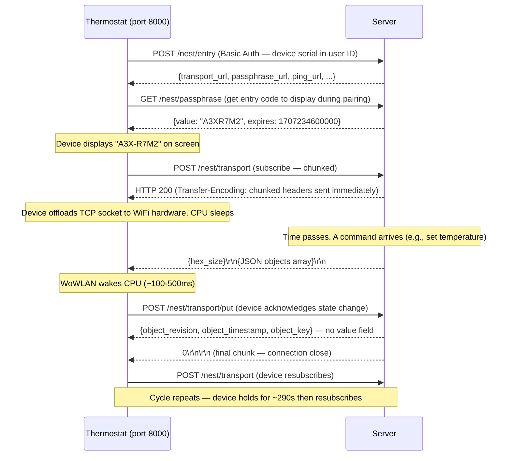

## Overview

The Nest thermostat initiates all connections. The server never dials out to the device. Instead, the device maintains a persistent long-poll connection and relies on the server to push data on it.

---

## Device Lifecycle (Full Flow)



---

## WoWLAN — How the Device Sleeps

The thermostat is battery-powered and aggressively manages CPU sleep. After the server sends chunked response headers, the device:

1. Hands the open TCP socket to its WiFi hardware chipset
2. Puts the main CPU to sleep
3. Relies on the WiFi hardware to monitor the socket for incoming data (WoWLAN — WiFi Wake-on-LAN)
4. When data arrives, the WiFi hardware wakes the CPU in ~100–500ms

**From the server's perspective:** the connection appears idle but is very much alive. You can push data at any time and the device will wake.

<Warning>
  **TCP keep-alive must be disabled server-side.** The device cannot respond to TCP keep-alive probes while its CPU is sleeping. Server-side `SO_KEEPALIVE` will cause the OS to close the connection after a few missed probes. The WiFi hardware keeps the connection alive independently.
</Warning>

---

## Subscribe Cycle Timing

| Phase | Duration | Who acts |
|-------|----------|----------|
| Headers sent | Immediate | Server sends `Transfer-Encoding: chunked` + headers |
| Connection held | 0–290s | Server waits silently for data to push |
| Data push | When available | Server sends chunk, device wakes in ~100–500ms |
| Batch window | ≤3s | Server may send additional chunks before closing |
| Close + resubscribe | ~100–500ms | Server sends `0\r\n\r\n`; device reconnects |

The server drives the reconnect cycle by closing the connection. The device's `X-nl-suspend-time-max` timer (default 300s) is a **safety net**, not the primary trigger.

---

## Two-Port Architecture

The self-hosted server runs two independent HTTP services:

```
┌─────────────────────────────────────────────────────────┐
│                  NoLongerEvil Server                     │
│                                                          │
│  Port 8000 — Device Protocol API                         │
│  ┌────────────────────────────────────────────────────┐  │
│  │  Nest protocol emulation (HTTP/1.1, long-poll)      │  │
│  │  /nest/entry  /nest/transport  /nest/passphrase ... │  │
│  │  Called by: thermostat firmware                     │  │
│  └────────────────────────────────────────────────────┘  │
│                                                          │
│  Port 8082 — Control API                                 │
│  ┌────────────────────────────────────────────────────┐  │
│  │  Simple REST/JSON control API (no auth)             │  │
│  │  /command  /status  /api/devices  /api/events ...   │  │
│  │  Called by: you (scripts, integrations, dashboard)  │  │
│  └────────────────────────────────────────────────────┘  │
└─────────────────────────────────────────────────────────┘
```

The device talks exclusively to port 8000. You talk exclusively to port 8082. The server coordinates state between both ports internally.

---

## Overlapping Subscriptions

When a device wakes early (user turns the dial), it sends a new subscribe request before the previous connection has closed. The server briefly sees two active subscriptions for the same device.

The correct handling:
1. Track each subscription with a server-generated ID (not the device's `session` field)
2. Push data to **all** active subscriptions when a change occurs
3. Remove a subscription only when its specific connection closes

The device's `session` field is reused across all subscribe requests during normal operation — it is not a unique connection identifier.
